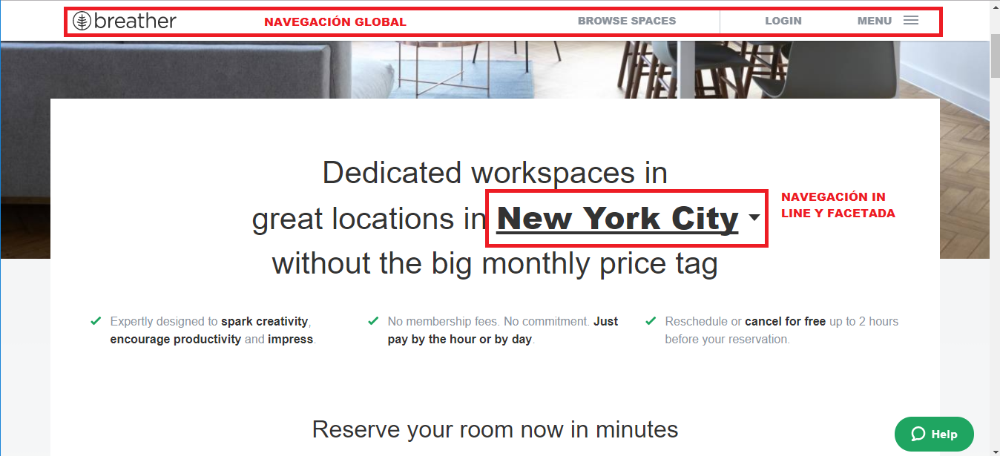
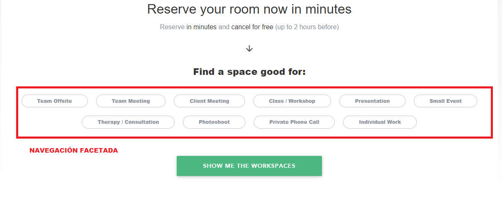
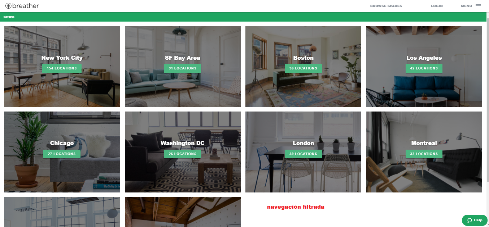

###Sprint 2. Reto Analizar un sitio web. Barras de navegación**

1.   Barras de navegación global

2.   Barras de navegación local

3.   Barras de navegación Facetada

4.   Barras de navegación Filtrada

5.   Barras de navegación contextual

6. Barras de navegación in line

